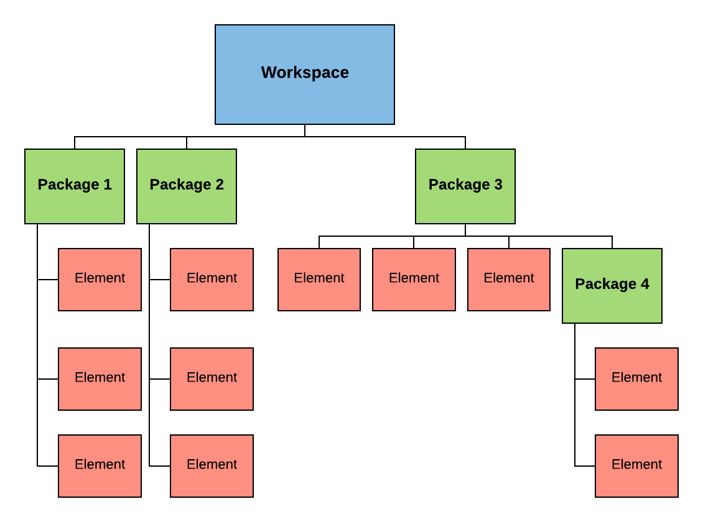

Overview
========

Basics
------

A workspace object is the root container that holds all items that you are currently working with.

Each workspace contains packages and each package contains elements or other packages (called sub-packages).

   
   AUTOSAR Workspace hierarchy.

Learn More
~~~~~~~~~~

- Creating workspaces.
- Creating packages and sub-packages.

AUTOSAR 3
---------

DataTypes
~~~~~~~~~

- IntegerType
- RealType
- ListType
- StringType
- ArrayType
- RecordType

AUTOSAR 4
---------

DataTypes
~~~~~~~~~

- BaseType
- ImplementationType
- ApplicationPrimitiveType